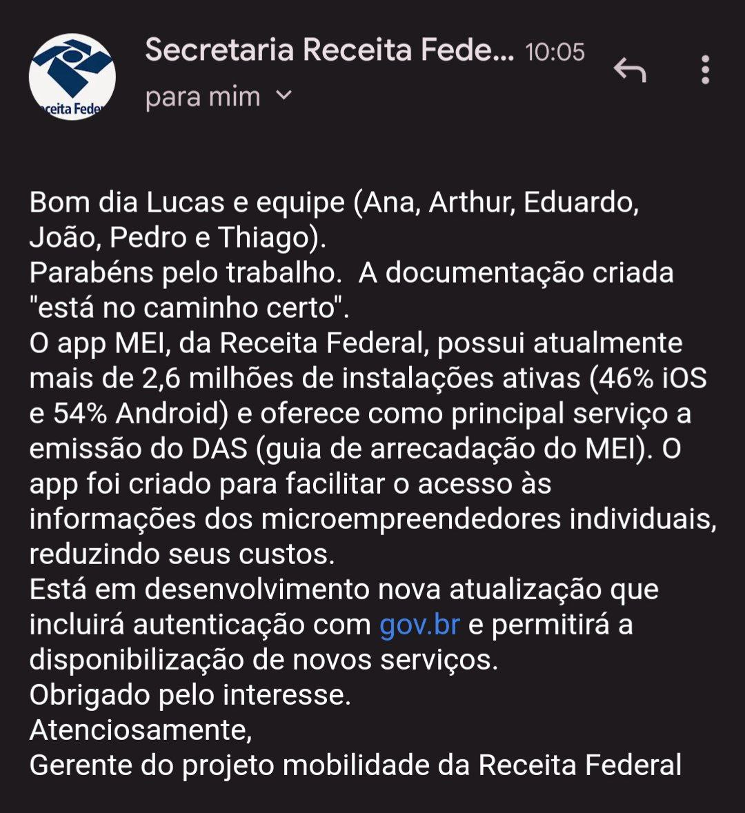

# Validação

## Introdução

Para analisar o grupo MEI por meio da validação, nós do grupo Lichess usamos um diferente meio para isso.

## Metodologia

A estratégia escolhida para o desenvolvimento desse documento foi a da comunicação informal. A validação por meio da comunicação informal é basicamente uma tarefa de leitura de descrições em linguagem natural e do uso dos clientes para identificar problemas. Podemos visualizar o email na imagem 1, e a resposta dos desenvolvedores na imagem 2

## Resultados

### Comprovação Informal

#### Email enviado para os desenvolvedores

Imagem 1: Email para desenvolvedores MEI

#### Resposta dos desenvolvedores do aplicativo MEI

Imagem 2: Resposta dos desenvolvedores MEI

## Histórico de Versão

| Versão | Data       | Descrição                                                                              | Autor(es)        | Revisor(es)  |
| ------ | ---------- | -------------------------------------------------------------------------------------- | ---------------- | ------------ |
| `1.0`  | 08/01/2023 | Criação do documento e adição da comprovação informal                                             | Davi         | Lucas Gabriel |
