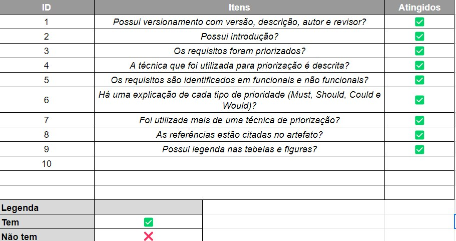

# Verificação - Priorização

## Introdução

Neste documento, será realizado a verificação do artefato sobre Priorização, desenvolvido pelo grupo MEI (<https://requisitos-de-software.github.io/2022.2-MEI/>).

## Resultados

### Priorização

Imagem 1: Verificação das priorização do grupo MEI

## Histórico de Versão

| Versão | Data          | Descrição                          | Autor(es)     |  Revisor(es)  |
| ------ | ------------- | ---------------------------------- | ------------- | ------------- |
| `1.0`  | 08/01/2023    | Criação do documento               | Lucas Macedo  |   Davi |
