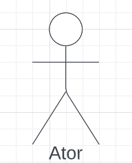
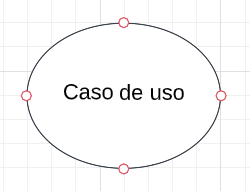
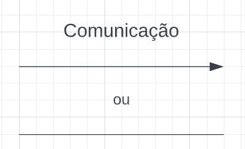
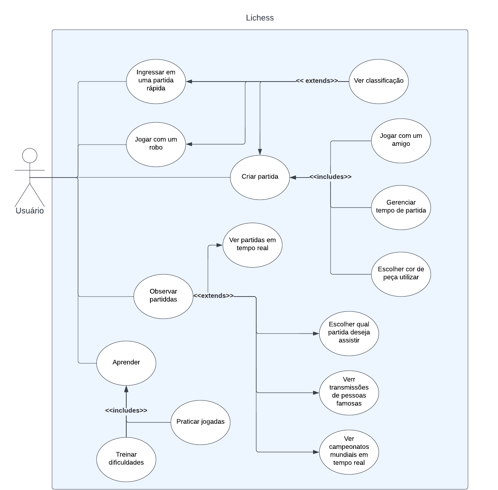

# Casos de Uso

## Introdução

O diagrama de casos de uso descreve um conjunto de ações, chamados de casos de uso, que um sistema desempenha, levando em consideração os usuários externos ao sistema. Ele pode ser usado para descrever as principais funcionalidades do sistema e a interação com os usuários.

## Metodologia

Para a criação desse artefato foi utilizado a abordagem tradicional, ou seja, representação os casos de uso através de uma diagrama UML. A ferramenta utilizada para a criação do diagrama foi o [LucidChart](https://www.lucidchart.com/pages/pt), um software online para criação de diagramas.

## Componentes e símbolos

Um diagrama de casos de uso é composto pelos elementos descritos a seguir.

### Atores

Representam os usuários e sistemas envolvidos nas interações, e normalmente são representados por bonecos de palitos (Figura 1).

 Figura 1: Ator (Fonte: autores, 2022).

### Cenário

Sequência de eventos que acontecem quando um usuário interage com o sistema. Geralmente representado por uma caixa (Figura 2). Todos os casos de uso fora da caixa são considerados fora do escopo do sistema.

 Figura 2: Cenário (Fonte: autores, 2022).

### Caso de uso

Caso de uso é uma atividade ou funcionalidade realizada pelo usuário. Geralmente são definidos na forma oval horizontal (Figura 3), onde cada forma é um uso diferente que o usuário pode ter. Como são ações, recomenda-se o uso de verbos no infinitivo para descrevê-las.

 Figura 3: Caso de uso (Fonte: autores, 2022).

### Comunicação (ou ação)

Como o verbo já diz, é a ação que comunica o usuário ao caso de uso, e pode ser visualizada na *Figura 4*. Para melhorar o entendimento, a ação pode ser definidas de duas formas, sendo elas:

**Inclusão:** Relação em que um caso de uso quando precisa ter sua funcionalidade executada através de outro caso de uso. Em outras palavras, quando um caso de uso A inclui um caso de uso B, onde quando o caso de uso A ser executado, o caso de uso B necessariamente será executado também.
  
- Notação no diagrama: *<<includes\>\>*
  
**Extensão:** Já a extensão significa que o caso de uso atual irá funcionar normalmente, porem alguns serão adicionados novos passos no caso de uso estendido. Ou seja, quando o caso de uso A é estendido pelo caso de uso B, se o primeiro for executado, o caso de uso B pode (ou não) ser executado também.
  
- Notação no diagrama: *<<extends\>\>*

 Figura 4: Cenário (Fonte: autores, 2022).

## Diagrama de Casos de Uso

 Figura 5: Diagrama de casos de uso (Fonte: autores, 2022).

A seguir, a especificação dos casos de uso identificados.

### UC01. Ingressar em uma partida rápida

| UC01 | Ingressar em uma partida rápida |
| -: | :- |
| **Atores** | <li> Usuário |
| **Frequência de uso** | Média |
| **Requisitos** | Conexão com a internet |
| **Condição de entrada** | O usuário seleciona uma das opções de partidas rápidas na tela inicial |
| **Fluxo principal** | <ol> <li> O sistema busca um oponente disponível <li> O sistema inicia a partida entre o usuário solicitante e o oponente encontrado </ol>|
| **Fluxos alternativos** | Não há |
| **Fluxos de exceção** | **Fluxo 1. O sistema não encontrou um oponente disponível** <ol> <li> O sistema busca um oponente disponível <li> O sistema apresenta uma tela com a mensagem "Nenhum oponente foi encontrado. Tentar novamente?" e botões com as opções "Sim" e "Retornar à tela inicial" <ul> <li> O usuário seleciona a opção "Sim" e o processo reinicia ou <li> O usuário seleciona a opção "Retornar à tela inicial" e a operação é cancelada</ul> </ol> **Fluxo 2. Falha na conexão com a internet** <ol> <li> O sistema busca um oponente disponível <li> O sistema apresenta uma tela com a mensagem "Falha na conexão. Tentar novamente?" e botões com as opções "Sim" e "Retornar à tela inicial"  <ul> <li> O usuário seleciona a opção "Sim" e o processo reinicia ou <li> O usuário seleciona a opção "Retornar à tela inicial" e a operação é cancelada</ul> </ol> |
| **Pós condições** | O usuário inicia uma partida rápida contra outro oponente|
| **Rastreabilidade** | [B16](../elicitacao/brainstorming.md#requisitos-elicitados) |

 Tabela 1: Especificação do caso de uso: Ingressar em uma partida rápida. (Fonte: autores, 2022).

### UC02. Jogar com um robô

| UC02 | Jogar com um robô |
| -: | :- |
| **Atores** | <li> Usuário <li> Inteligência Artificial |
| **Frequência de uso** | Alta |
| **Requisitos** | Não há |
| **Condição de entrada** | O usuário seleciona a opção "jogar contra o computador" na tela inicial |
| **Fluxo principal** | <ol> <li> O sistema apresenta a tela de configuração da partida, com as seguintes configurações, em campos de seleção:<ul> <li> Cor <li> Variante <li> Nível <li> Relógio <li> Tempo <li> Incremento </ul> <li> O sistema inicia a partida contra o computador (Inteligência Artificial) </ol>|
| **Fluxos alternativos** | Não há |
| **Fluxos de exceção** | Não há |
| **Pós condições** | O usuário inicia uma partida rápida contra o computador |
| **Rastreabilidade** | [INT01](../elicitacao/introspeccao.md#elicitacao-de-requisitos) |

 Tabela 2: Especificação do caso de uso: Jogar com um robô. (Fonte: autores, 2022).

### UC03. Observar partidas

| UC03 | Observar partidas |
| -: | :- |
| **Atores** | <li> Usuário  |
| **Frequência de uso** | Baixa |
| **Requisitos** | Conexão com a internet |
| **Condição de entrada** | O usuário seleciona a opção "Assistir partidas" no menu principal |
| **Fluxo principal** | <ol> <li> O sistema busca as partidas em andamento <li> O sistema apresenta uma lista de partidas, em ordem crescente de acordo com o *ranking* dos jogadores, que estão acontecendo no momento <li> O usuário clica na opção de filtrar partidas selecionadas <li> O sistema apresenta um formulário para configuração do filtro para buscar partidas, onde o usuário pode inserir: <ul> <li> Usuário (campo textual) <li> Modalidade (campo de seleção) <li> Partida finalizada (campo de seleção: sim/não) <li> Código do campeonato (campo numérico) </ul> <li> O usuário configura os filtros desejados e seleciona a opção "Buscar" <li> A lista de partidas exibidas é atualizada <li> O usuário seleciona a partida desejada <li> O sistema apresenta a partida selecionada, com as opções: <ul> <li> Pausar <li> Lista de movimentos <li> Assistir do início <li> Avançar movimentos <li> Voltar movimentos </ul></ol> |
| **Fluxos alternativos** | Não há |
| **Fluxos de exceção** | **Fluxo 2. Falha na conexão com a internet** <ul> <li> O sistema busca as partidas disponíveis <li> O sistema apresenta uma tela com a mensagem "Falha na conexão. Tentar novamente?" e botões com as opções "Sim" e "Retornar à tela inicial"  <ul> <li> O usuário seleciona a opção "Sim" e o processo reinicia ou <li> O usuário seleciona a opção "Retornar à tela inicial" e a operação é cancelada</ul> </ul> |
| **Pós condições** | O usuário assiste a partida entre dois jogadores |
| **Rastreabilidade** | [ST06](../elicitacao/storytelling.md#requisitos-elicitados) |

 Tabela 3: Especificação do caso de uso: Observar partidas. (Fonte: autores, 2022).

### UC04. Aprender

| UC04 | Aprender |
| -: | :- |
| **Atores** | <li> Usuário  |
| **Frequência de uso** | Média |
| **Requisitos** | Não há |
| **Condição de entrada** | O usuário seleciona a opção "Aprender" no menu principal |
| **Fluxo principal** | <ol> <li> O sistema apresenta as opções de aprendizado disponíveis para seleção do usuário: tutoriais e quebra-cabeças. <li> O usuário seleciona o </ol> |
| **Fluxos alternativos** | Não há |
| **Fluxos de exceção** | **Fluxo 2. Falha na conexão com a internet** <ul> <li> O sistema busca as partidas disponíveis <li> O sistema apresenta uma tela com a mensagem "Falha na conexão. Tentar novamente?" e botões com as opções "Sim" e "Retornar à tela inicial"  <ul> <li> O usuário seleciona a opção "Sim" e o processo reinicia ou <li> O usuário seleciona a opção "Retornar à tela inicial" e a operação é cancelada</ul> </ul> |
| **Pós condições** | O usuário assiste a partida entre dois jogadores |
| **Rastreabilidade** | [INT07, INT12, INT13, INT14](../elicitacao/introspeccao.md#elicitação-de-requisitos) |

 Tabela 4: Especificação do caso de uso: Aprender. (Fonte: autores, 2022).

### UC05. Ver classificação

## Bibliografia

[1] DevMedia. O que é UML e Diagramas de Caso de Uso: Introdução Prática à UML. 2012. DevMedia. Disponível em: <https://www.devmedia.com.br/o-que-e-uml-e-diagramas-de-caso-de-uso-introducao-pratica-a-uml/23408>. Acessado em 07 de dez. de 2022.

[2] IBM. Diagramas de Caso de Uso. IBM. Disponível em: <https://www.ibm.com/docs/pt-br/rsm/7.5.0?topic=diagrams-use-case>. Acessado em 07 de dez. de 2022

[3] Ferramenta Lucidchart, disponível no [link](https://www.lucidchart.com/pages/pt). Acessado em 07 de dez. de 2022.

[4] SERRANO M., SERRANO M. Requisitos - Aula 13. Disponível na plataforma Aprender3. Acessado em 08 de dez. de 2022.

[5] DevMedia. Especificação de Casos de Uso na Prática. 2010. DevMedia. Disponível em no [link](https://www.devmedia.com.br/especificacao-de-casos-de-uso-na-pratica/18427). Acessado em 09 de dez. de 2022.

## Histórico de Versão

| Versão | Data          | Descrição                          | Autor(es)     |  Revisor(es)  |
| ------ | ------------- | ---------------------------------- | ------------- | ------------- |
| `1.0`  |        07/12/2022       |        Criação inicial do documento                            |     Lucas Macedo          |  Nicolas Souza       |
| `1.1` | 09/12/2022 | Inclusão da especificação dos casos de uso. | Nicolas Souza |
