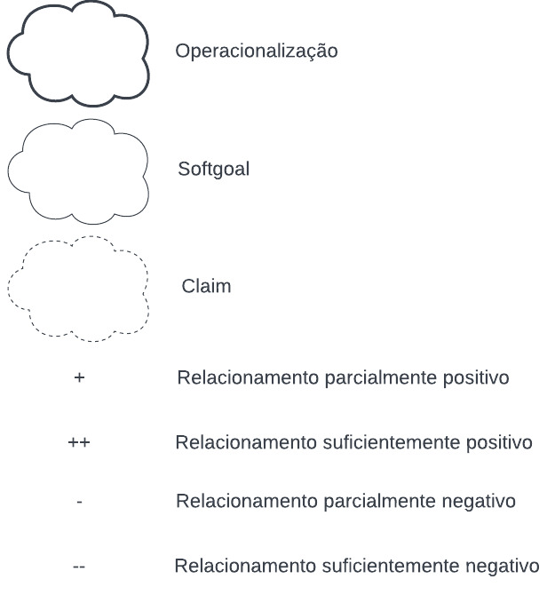
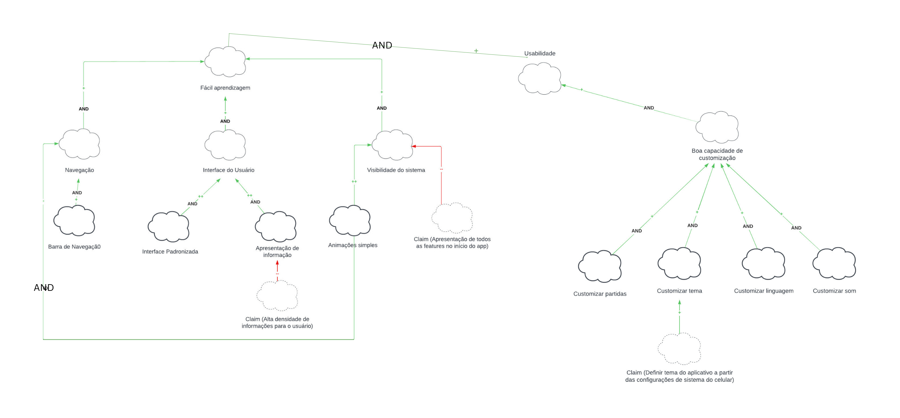
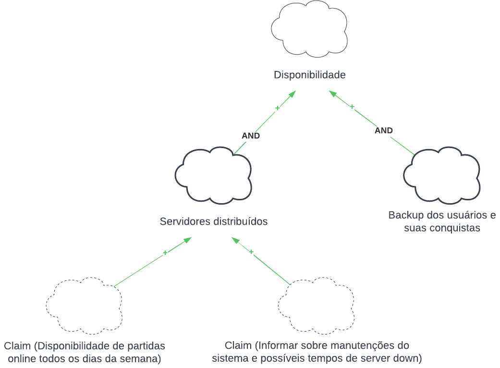
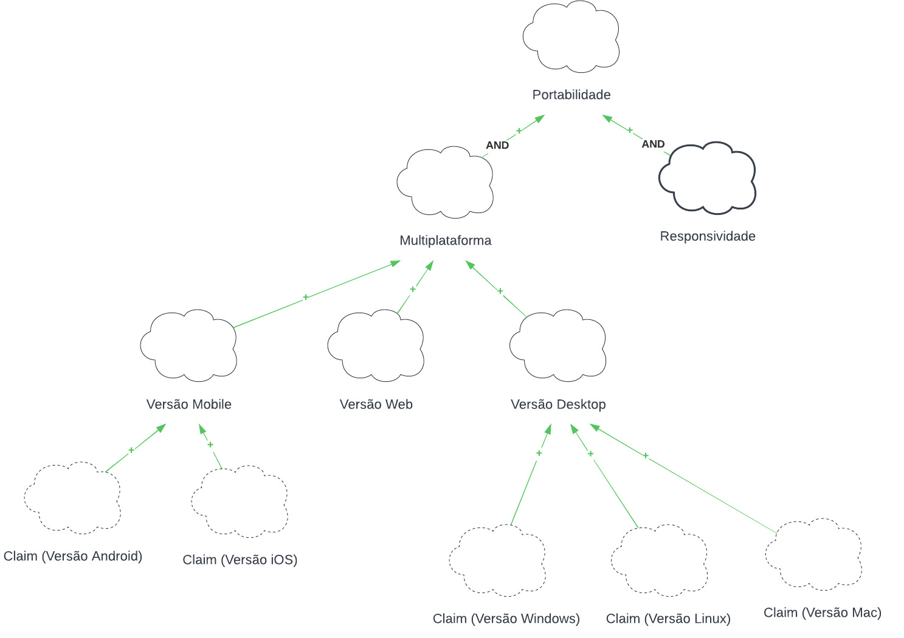
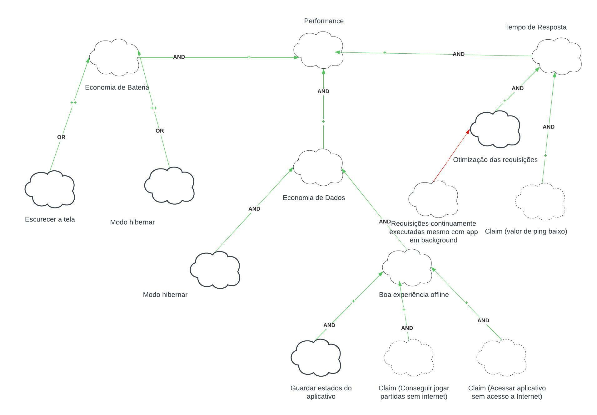

# NFR Framework

O NFR Framework é uma abordagem para representar e analisar Requisitos Não-Funcionais. Seu objetivo é ajudar desenvolvedores na implementação de soluções personalizadas, levando em consideração as características do domínio e dos sistema em questão.

O Framework utiliza de softgoals, um objetivo que não possui uma clara definição nem critérios de satisfação precisos. São utilizados para representar Requisitos Não-Funcionais e podem estar inter-relacionados, expressando a influência de uma softgoal em outro.

É representado por meio de um grafo, chamado Softgoal Interdependency Graph (SIG), que registra as considerações do desenvolvedor sobre os softgoals e mostra suas interdependências.

Os softgoals podem ser separados em 3 tipos:

- NFR Softgoal – Característica abstrata, a qual se deseja considerar na análise, visando saber se a mesma será cumprida ou não cumprida, ou seja, escolhida ou não escolhida para ser implementada. São requisitos não funcionais, vistos como critérios/atributos de qualidade.

- Softgoal de Operacionalização – forma concreta de viabilizar ou não as características abstratas. São funcionalidades.

- Claim Softgoal (Argumentation) – a notação que pode ser acrescentada ao modelo, argumentando algo sobre um ponto específico da modelagem. Escrita em linguagem natural.

Cada um desses Softgoals podem ser decompostos, e os tipos de decomposição são:

- Decomposição de Softgoal NFR: refina ou subdivide um um softgoal NFR em outros específicos. Isso pode ajudar a dividir grandes problemas em problemas menores e oferece um aspecto útil para lidar com ambiguidades e prioridades.

- Decomposição de Operacionalização: subdivide um softgoal de operacionalização em outros softgoals de operacionalização mais específicos. Operacionalizações são úteis para definir uma solução geral e refiná-la em soluções mais específicas.

- Decomposição de Afirmação (Claims): refina um softgoal de afirmação em outros softgoals de afirmação. Ela é importante para apoiar ou negar justificativas específicas de projeto.

- Priorização: A priorização é um tipo especial de decomposição, onde ocorre o refinamento de um softgoal em outro softgoal com o mesmo tipo e tópicos, mas com uma prioridade associada.

As decomposições são especificações dos softgoals, ou seja, alterações no estado de um softgoal filho geram alterações no softgoal pai, e essas alterações são chamadas de contribuições. Essas contribuições são:

| Contribuição | Descrição                                                                                                                                                  |
| ------------ | ----------------------------------------------------------------------------------------------------------------------------------------------------------- |
| AND          | se os softgoals descendentes forem satisfeitos os softgoals ascendentes também são.                                                                         |
| OR           | se algum softgoal descendente form satisfeito, o ascendente é satisfeito.                                                                                   |
| MAKE(++)     | se o softgoal descendente for satisfeito o softgoal pai também é.                                                                                           |
| BREAK(--)    | se o softgoal descendente for suficientemente satisfeito, o softgoal pai é negado.                                                                          |
| HELP(+)      | se o softgoal descendente for parcialmente satisfeito, o softgoal ascendente será parcialmente satisfeito.                                                  |
| HURT(-)      | se o softgoal descendente for satisfeito, o softgoal ascendente será parcialmente negado.                                                                   |
| UNKNOWN(?)   | fornece uma contribuição desconhecida entre um softgoal descendente e um ascendente, e pode ser tanto positiva quanto negativa.                             |
| EQUALS       | o softgoal descendente só será satisfeito se o softgoal ascendente for satisfeito / o softgoal descendente será negado se o softgoal ascendente for negado. |
| SOME (+\|-)  | usado se o sinal da contribuição é conhecido, mas a extensão(parcial ou total) não é.                                                                       |

Por fim, para a análise dos softgoals, são atribuídos rótulos que definem o grau de satisfação de um softgoal. Ao atribuir um rótulo em um softgoal de baixo nível, é feita a propagação da satisfação daquele requisito de acordo com as contribuições definidas.

## NFRs

A seguir estão apontados 4 NFRs que fizemos o rastreio e estudo mais profundo. Eles são: **usabilidade, disponibilidade, portabilidade, performance**.

### Legenda

A figura 1 apresenta a legenda dos diagramas NFRs que serão mencionados no restante do texto.

 Figura 1: Legenda NFR. (Fonte: autor, 2022).

### NFR Usabilidade

Na figura 2 temos o diagrama representando o NFR de usabilidade.

 Figura 2: Diagrama NFR Usabilidade. (Fonte: autor, 2022).

### NFR Disponibilidade

Na figura 3 temos o diagrama representando o NFR de disponibilidade.

 Figura 3: Diagrama NFR Disponibilidade. (Fonte: autor, 2022).

### NFR Portabilidade

Na figura 4 temos o diagrama representando o NFR de portabilidade.

 Figura 4: Diagrama NFR Portabilidade. (Fonte: autor, 2022).

### NFR Performance

Na figura 5 temos o diagrama representando o NFR de performance.

 Figura 5: Diagrama NFR Performance. (Fonte: autor, 2022).

## Bibliografia

[1] SILVA, Reinaldo. **NFR4ES: Um Catálogo de Requisitos Não-Funcionais para Sistemas Embarcados.**

[2] SERRANO, Milene - SERRANO, Maurício. Requisitos - Aula 17. Local: UnB-FGA, Gama, DF. Disponível em: [Requisitos - Aula 16](https://aprender3.unb.br/mod/resource/view.php?id=861032). Acesso em: 10 de Dezembro de 2022.

## Histórico de Versão

| Versão | Data          | Descrição                          | Autor(es)     |  Revisor(es)  |
| ------ | ------------- | ---------------------------------- | ------------- | ------------- |
| `1.0`  | 10/12/2022    | Criação da versão inicial do documento | Maurício Machado | Nicolas Souza  |
