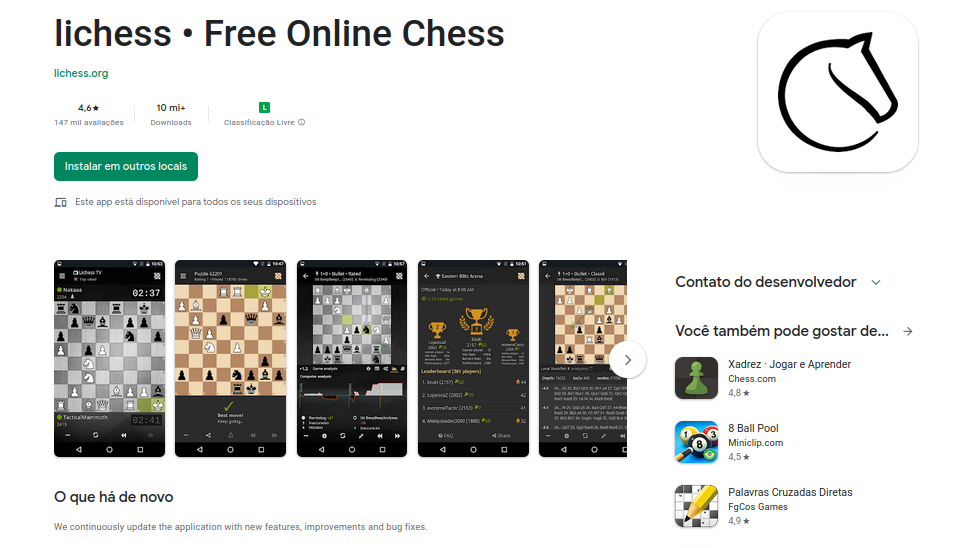

# Aplicativo selecionado para o projeto da disciplina

## Aplicativos analisados

Durante a primeira etapa do projeto, os estudantes realizaram escolhas de aplicativos, do governo ou comunidades de software livre, de forma individual a fim de trazerem propostas para o aplicativo a ser trabalhado pelo grupo durante a disciplina de Requisitos de Software, dessa forma cada um faz uma breve avaliação e produziu o artefato Rich Picture inicial relativo a sua escolha, com base nessas escolhas foram debatidas ideias a respeito de qual desses melhor se encaixaria para ser trabalhado durante a disciplina. Na tabela a seguir, Tabela 1, é possível observar essa escolha de cada integrante do grupo e o Rich Picture produzido.

| Nome             | Aplicativo     | Rich Picture                                           |
| ---------------- | -------------- | ------------------------------------------------------ |
| Lucas Macedo     | Cadastro Único | [Rich Picture](images/rich-picture-lucas-macedo.jpeg)  |
| Maurício Machado | Medium         | [Rich Picture](images/rich-picture-mauricio.jpeg)      |
| Lucas Gabriel    | Lichess        | [Rich Picture](images/rich-picture-lucas-gabriel.jpeg) |
| Nicolas Chagas   | Resultados TSE | [Rich Picture](images/rich-picture-nicolas.png)        |
| Davi Silva       | Sesc DF        | [Rich Picture](images/rich-picture-davi.jpeg)          |
| Renan Rodrigues  | Spc Brasil     | [Rich Picture](images/rich-picture-renan.jpeg)         |

Tabela 1 - Tabela dos aplicativos analisados

## Aplicativo definido pela equipe

Depois da seleção individual, as propostas foram discutidas pela equipe baseando-se nos seguintes critérios:

- Aplicativo ainda não trabalhado na disciplina de Requisitos de Software.
- Necessidade de manter a versão antiga, momento do início do projeto, sem atualizações no dispositivo celular de um dos integrantes.
- Aplicativo pertencente ao governo ou a uma comunidade de software livre.
- Facilidade de acesso aos usuários do aplicativo.

### Lichess

Dentre os aplicativos analisados de forma individual, o aplicativo escolhido foi o "[__Lichess__](https://play.google.com/store/apps/details?id=org.lichess.mobileapp&hl=pt_BR&gl=US)". Pois, esse foi o que melhor se adequou aos critérios apresentados anteriormente, principalmente com relação à facilidade de contato com os usuários devido aos grupos de xadrez existentes na Universidade de Brasília. Esse é um aplicativo gratuito, disponível para Android, na plataforma da Play Store, o qual teve seu projeto inicial realizado como um hobby que com a ajuda da iniciativa de software livre se tornou uma das maiores referências em xadrez online no mundo, mesmo sem fins lucrativos. Segue, na Figura 1, a página do aplicativo na Play Store.

Figura 1 - Imagem do aplicativo na Play Store

## Histórico de Versão

| Versão | Data       | Descrição            | Autor         | Revisor  |
| ------ | ---------- | -------------------- | ------------- | :--------: |
| `1.0`  | 17/11/2022 | Criação do documento | Lucas Gabriel | Maurício |
| `1.1`  | 18/11/2022 | Ajustes na tabela e nas legendas | Nicolas Souza | - |
