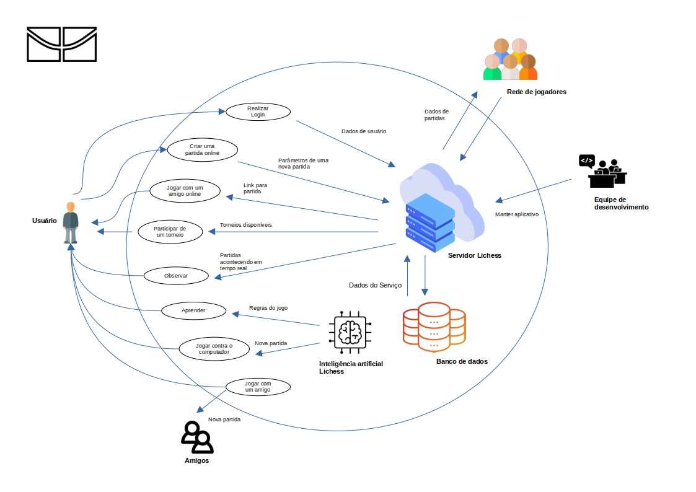
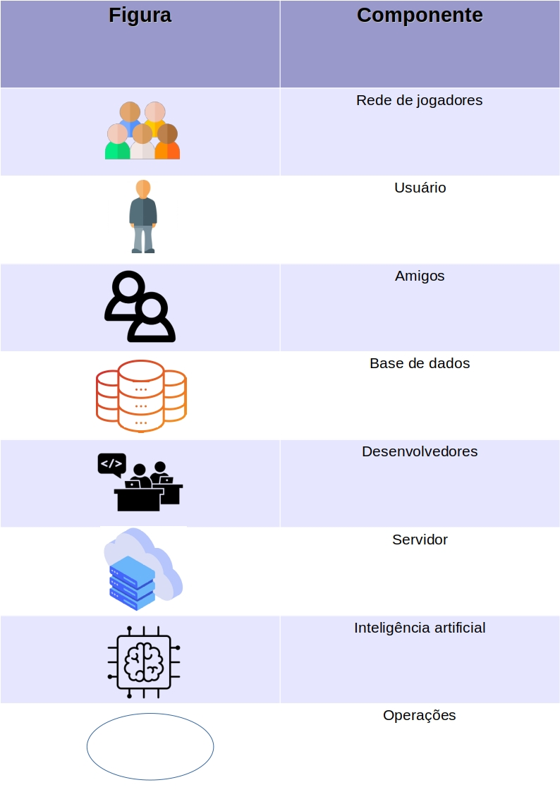

# Rich Pictures

## 1. Introdução:

Rich picture é um esboço de uma situação em que é ilustrado os principais elementos e relações que precisam ser considerados na tentativa de criar alguma melhoria ou funcionalidade. Consiste em imagens, texto, símbolos e ícones, que são usados para ilustrar graficamente a situação. As rich pictures fornecem um mecanismo para aprender sobre problemas complexos ou mal definidos, desenhando representações detalhadas dos mesmos.

## 2. Versões
### 2.1 Versão 1.0

<figcaption>Imagem 1: Rich Picture versão 1.</figcaption>
 

## 3. Legenda
Foram utilizados os seguintes componentes para a elaboração do Rich Picture:.

<figcaption>Imagem 2: Legenda do Rich Picture.</figcaption>
 

## 4. Histórico de Versões

| Versão | Data | Descrição | Autor | Revisor |
| :------: | :--------: |:----------------------------: | :-----------: | :--------------: |
| `1.0` | 20/11/2022 | Criação do Rich Picture Versão 1 | Renan Lacerda | Davi Silva |

## 5. Referências

- Young, Ralph. **Requirements Engineering Handbook**. Norwood, US: Artech House Books, 2003.

- Leite, Julio Cesar Sampaio do Prado. **Livro Vivo - Engenharia de Requisitos**. Disponível em: http://livrodeengenhariaderequisitos.blogspot.com.br/